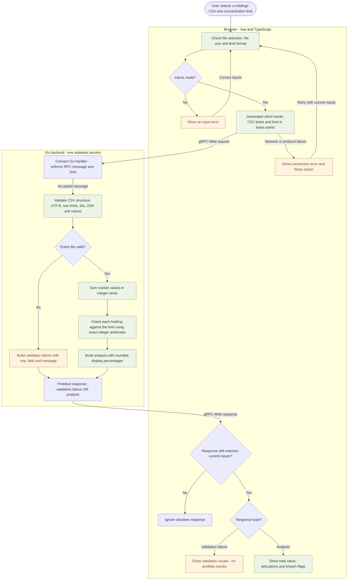
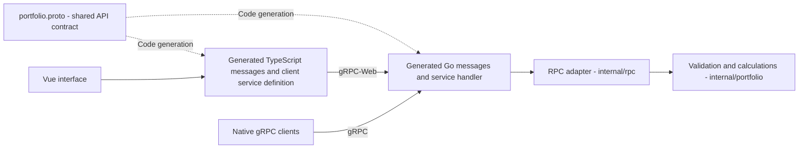

# Ledger — Portfolio Checker

A focused portfolio-operations demo built with **Go, Vue 3, TypeScript, Protobuf and gRPC-Web**. Upload fictional ZAR holdings, validate the entire file, inspect allocations and identify holdings above a configurable concentration limit.

The project demonstrates the data quality and typed service boundaries behind an investment operations workflow. It implements an **example concentration rule**, not a regulatory compliance assessment. No trading or investment recommendations are made.

## Get the source

Public repository: https://github.com/JoshMalkinson/ledger-portfolio-checker

```shell
git clone https://github.com/JoshMalkinson/ledger-portfolio-checker.git
cd ledger-portfolio-checker
```

Open the cloned folder, then follow the steps below.

## Run on Windows

Prerequisites: Windows x64, PowerShell, Node 22.12+ (Node 24 LTS recommended), and npm. Internet access is needed for the first setup. No database, Docker or cloud account is needed.

Open PowerShell in this directory:

```powershell
./scripts/setup.ps1
./scripts/run.ps1
```

Open **http://127.0.0.1:8080**. Ctrl+C stops the server. If your personal PowerShell policy blocks scripts, use `powershell -ExecutionPolicy Bypass -File ./scripts/setup.ps1` and the same form for `run.ps1`; this applies only to that process.

Setup downloads the pinned Go 1.27.1 Windows archive from go.dev, checks its SHA-256 and restores locked dependencies. Within the original workspace it reuses `../../work/tooling`; a standalone copy uses the ignored `.tools` directory. You can select another directory with `PORTFOLIO_TOOLS`. Go modules use that directory's `gopath`; the normal npm and Go build caches may also be used. System Go installation and permanent PATH changes are not required.

For frontend hot reload:

```powershell
./scripts/dev.ps1
```

Open http://127.0.0.1:5173. The script runs Go on 8080 and Vite on 5173, stopping both on exit. Restart it after changing Go code. Both ports must be available.

## A two-minute demo

1. Download **Valid CSV** from the app and select it in the upload area.
2. Set the limit to **50%** and run the check. Alpha is 60%, Beta is 40%; only Alpha is above the limit. Total value is ZAR 100.00.
3. Change the limit to **60%**. The previous result is marked outdated. Rerun: both holdings are within the limit because equality passes.
4. Upload **Invalid CSV**. Row 3 has a duplicate instrument ID and a negative market value. The app reports both and does not calculate a partial portfolio.

## CSV contract

```csv
instrument_id,instrument_name,currency,market_value
A,Alpha,ZAR,60.00
B,Beta,ZAR,40.00
```

- Exact four-column header in that order; UTF-8, optionally with a BOM.
- At most 1 MiB and 1,000 holdings. Blank lines are ignored; quoted CSV fields and multiline names are supported.
- IDs are trimmed and uppercased. Duplicate normalised IDs are rejected, rather than silently combined.
- Names must contain non-whitespace text. Currency must be exactly `ZAR`.
- Market value means the value of the entire holding, not a unit price. It must be a positive plain decimal, up to `1000000000.00`, with at most two fractional digits. Currency symbols, separators and exponents are rejected.
- Concentration limits range from `0.01` to `100`, with up to two fractional digits; default `20`.
- Error rows refer to physical CSV lines, with 0 reserved for a whole-file issue.

## System flowchart

The browser collects the inputs; Go validates the complete file before calculating any portfolio results. Invalid data returns actionable errors instead of a partial analysis.



If the user changes an input while a check is running, the browser cancels that request and ignores any late response. If a result is already displayed, it is marked outdated until the user runs another check. Files are processed in memory for each request; there is no database.

### How the components connect



`proto/portfolio/v1/portfolio.proto` is the shared contract. The response has a Protobuf `oneof`: validation failure or portfolio analysis. Generated clients and handlers perform serialization. Connect is the library; **the browser explicitly uses the gRPC-Web wire protocol**, and the same backend also serves native gRPC. This is verified with actual protocol integration tests, not a JSON substitute. No separate Envoy process is required.

The Go domain package knows nothing about Vue, Protobuf or HTTP. `internal/rpc` maps domain results to messages. Go serves `web/dist` in the production demo; Vite proxies the RPC path in development. `/healthz` returns `ok`.

### Why money uses integers

Go stores market values in cents (`int64`), and the frontend receives Protobuf int64 values as `bigint`. For a holding worth `v` cents, portfolio total `t` cents and limit `b` basis points:

```text
breach = v × 10000 > t × b
```

No division or rounding is involved in that decision. The input caps keep these products inside int64. Display percentages are rounded to two decimal places and may not sum to 100%. A value just above 50% can correctly breach while displaying 50.00%.

### State and failure handling

Changing a file or limit cancels the current request and invalidates its sequence number, so a late response cannot overwrite newer state. Previous results are visibly marked outdated. Server-side validation is authoritative; the UI adds immediate file/limit checks. Failures show a retry action. Files are held in memory per request and are not stored by the application or logged. This is not a claim that operating-system memory is securely erased.

## Verify and regenerate

```powershell
./scripts/verify.ps1
./scripts/generate.ps1
git diff -- gen web/src/gen
```

`verify.ps1` runs Go tests, Go vet, Vue tests, type checking and a production build; any failed command stops it. `generate.ps1` runs Buf lint and pinned local generators. Generated files are committed, so ordinary startup does not require generation.

With the production server running in another terminal:

```powershell
cd web
npm run e2e
```

Browser tests use the installed Microsoft Edge in headless mode. They cover real upload-to-response behaviour, gRPC-Web content type, equality at the threshold, validation errors and a 390px mobile layout. Unit tests cover request cancellation, stale data, retry, loading and literal rendering of uploaded markup. Go tests cover exact arithmetic, upper bounds, malformed data, physical row numbers, native gRPC and gRPC-Web.

Versions are pinned in `go.mod`, `web/package.json` and `web/package-lock.json`. TypeScript is intentionally pinned to 5.9.3 because the installed Vue type checker expects its compiler entry point. Test execution uses one worker for predictable resource use on this machine.
